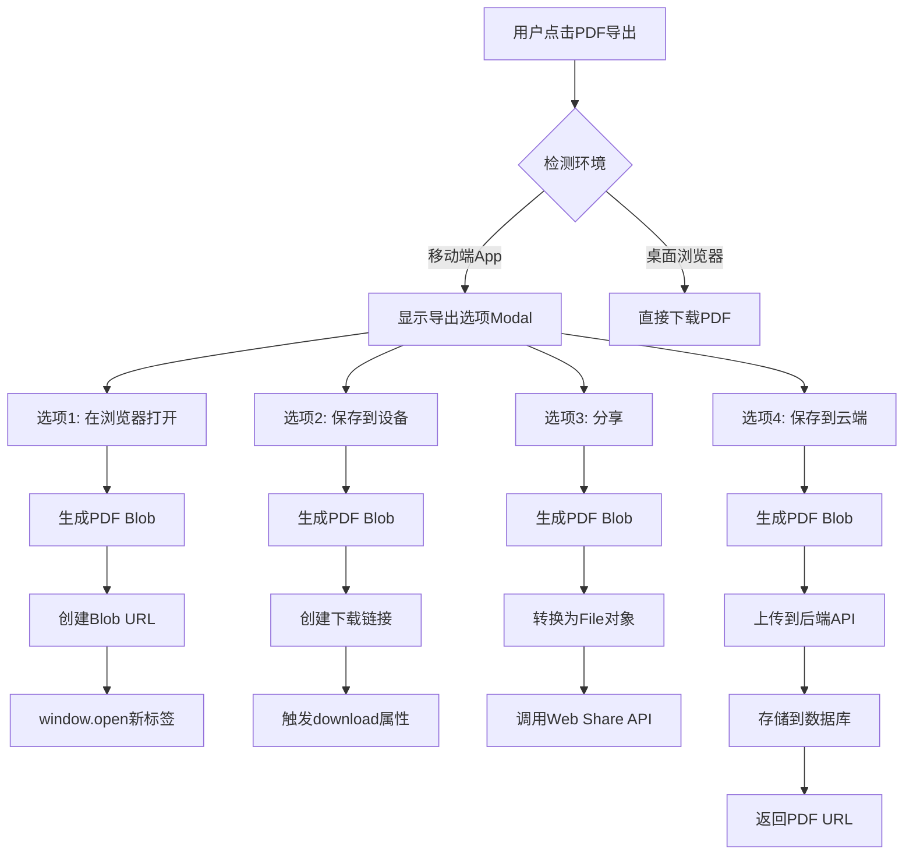

# 移动端PDF导出增强方案

## 📋 问题分析

### 当前问题
- **症状**: 在移动端点击PDF导出按钮后，显示loading动画但没有任何输出
- **根本原因**: 移动端WebView环境中`window.open(url, '_blank')`被安全策略阻止
- **影响范围**: 所有移动端用户无法导出PDF训练报告

### 用户需求
1. **在浏览器中打开PDF** - 用户可以选择在外部浏览器中查看PDF
2. **保存到设备** - 直接保存PDF到设备本地存储
3. **分享到其他应用** - 通过系统分享功能分享PDF（微信、邮件等）
4. **保存到服务器** - 将PDF上传到服务器，方便跨设备访问和历史记录管理

---

## 🎯 解决方案设计

### 方案架构



### 技术栈选择

#### 前端技术
- **环境检测**: User Agent + Display Mode检测
- **Modal组件**: React + Tailwind CSS
- **文件处理**: Blob API + File API
- **分享功能**: Web Share API (navigator.share)
- **下载功能**: HTML5 Download Attribute + Blob URL
- **网络请求**: Fetch API + FormData

#### 后端技术
- **文件存储**: Supabase Storage (PostgreSQL + S3-compatible)
- **数据库**: Prisma ORM + PostgreSQL
- **API框架**: Express.js
- **文件上传**: Multer middleware
- **认证**: JWT Token (已有authMiddleware)

---

## 📐 数据库设计

### 新增WorkoutPDF模型

```prisma
model WorkoutPDF {
  id          String   @id @default(uuid())
  userId      String   @map("user_id")
  workoutId   String?  @map("workout_id")
  fileName    String   @map("file_name")
  fileSize    Int      @map("file_size")      // bytes
  fileUrl     String   @map("file_url")       // Supabase Storage URL
  language    String   @default("CN")         // CN | EN
  createdAt   DateTime @default(now()) @map("created_at")
  
  user        User     @relation(fields: [userId], references: [id], onDelete: Cascade)
  workout     Workout? @relation(fields: [workoutId], references: [id], onDelete: SetNull)
  
  @@map("workout_pdfs")
  @@index([userId, createdAt])
  @@index([workoutId])
}
```

### 更新User模型
```prisma
model User {
  // ... 现有字段
  workoutPDFs  WorkoutPDF[]  // 新增关系
}
```

### 更新Workout模型
```prisma
model Workout {
  // ... 现有字段
  pdfs         WorkoutPDF[]  // 新增关系
}
```

---

## 🔧 API设计

### 1. 上传PDF到服务器
**Endpoint**: `POST /api/workout/pdf/upload`

**Request Headers**:
```
Authorization: Bearer <jwt_token>
Content-Type: multipart/form-data
```

**Request Body** (FormData):
```typescript
{
  file: Blob,              // PDF文件
  workoutId?: string,      // 可选：关联的训练ID
  language: 'CN' | 'EN',   // PDF语言
  fileName: string         // 文件名
}
```

**Response** (200 OK):
```typescript
{
  success: true,
  pdf: {
    id: string,
    userId: string,
    workoutId: string | null,
    fileName: string,
    fileSize: number,
    fileUrl: string,
    language: string,
    createdAt: string
  }
}
```

**Error Responses**:
- `400`: 文件格式错误或缺少必需参数
- `401`: 未授权
- `413`: 文件过大（限制10MB）
- `500`: 服务器错误

---

### 2. 获取用户的PDF列表
**Endpoint**: `GET /api/workout/pdf`

**Query Parameters**:
```typescript
{
  workoutId?: string,  // 可选：筛选特定训练的PDF
  limit?: number,      // 默认20
  offset?: number      // 默认0
}
```

**Response** (200 OK):
```typescript
{
  success: true,
  count: number,
  pdfs: Array<{
    id: string,
    workoutId: string | null,
    fileName: string,
    fileSize: number,
    fileUrl: string,
    language: string,
    createdAt: string
  }>
}
```

---

### 3. 删除PDF
**Endpoint**: `DELETE /api/workout/pdf/:id`

**Response** (200 OK):
```typescript
{
  success: true,
  message: "PDF deleted successfully"
}
```

---

## 🎨 前端组件设计

### 1. PDFExportOptionsModal组件

**位置**: `frontend/src/features/export/components/PDFExportOptionsModal.tsx`

**Props接口**:
```typescript
interface PDFExportOptionsModalProps {
  isOpen: boolean;
  onClose: () => void;
  pdfBlob: Blob;
  fileName: string;
  workoutId?: string;
  language: 'CN' | 'EN';
}
```

**功能特性**:
- ✅ 4个导出选项按钮（浏览器打开、保存到设备、分享、保存到云端）
- ✅ 每个选项显示图标、标题、描述
- ✅ Loading状态指示
- ✅ 错误处理和用户反馈
- ✅ 响应式设计（移动端优化）
- ✅ 中英文双语支持

**UI设计**:
```
┌─────────────────────────────────────┐
│  导出PDF                      [X]   │
├─────────────────────────────────────┤
│                                     │
│  ┌───────────────────────────────┐ │
│  │ 🌐 在浏览器中打开             │ │
│  │ 在新标签页中查看PDF           │ │
│  └───────────────────────────────┘ │
│                                     │
│  ┌───────────────────────────────┐ │
│  │ 💾 保存到设备                 │ │
│  │ 下载PDF到本地存储             │ │
│  └───────────────────────────────┘ │
│                                     │
│  ┌───────────────────────────────┐ │
│  │ 📤 分享                       │ │
│  │ 通过系统分享功能发送          │ │
│  └───────────────────────────────┘ │
│                                     │
│  ┌───────────────────────────────┐ │
│  │ ☁️ 保存到云端                 │ │
│  │ 上传到服务器，随时访问        │ │
│  └───────────────────────────────┘ │
│                                     │
└─────────────────────────────────────┘
```

---

### 2. 更新PDFExportService

**位置**: `frontend/src/features/export/services/PDFExportService.ts`

**新增函数**:

```typescript
/**
 * 检测是否在移动端App环境
 */
export const isMobileApp = (): boolean => {
  const ua = navigator.userAgent;
  const isWebView = /ZenFit|WebView|wv/i.test(ua);
  const isStandalone = window.matchMedia('(display-mode: standalone)').matches;
  const isIOSStandalone = (window.navigator as any).standalone === true;
  
  return isWebView || isStandalone || isIOSStandalone;
};

/**
 * 在浏览器中打开PDF
 */
export const openPDFInBrowser = (blob: Blob): void => {
  const url = URL.createObjectURL(blob);
  const newWindow = window.open(url, '_blank');
  
  if (!newWindow) {
    throw new Error('无法打开新窗口，请检查浏览器弹窗设置');
  }
  
  // 延迟释放URL
  setTimeout(() => URL.revokeObjectURL(url), 3000);
};

/**
 * 保存PDF到设备
 */
export const savePDFToDevice = (blob: Blob, fileName: string): void => {
  const url = URL.createObjectURL(blob);
  const link = document.createElement('a');
  link.href = url;
  link.download = fileName;
  link.style.display = 'none';
  
  document.body.appendChild(link);
  link.click();
  document.body.removeChild(link);
  
  setTimeout(() => URL.revokeObjectURL(url), 100);
};

/**
 * 通过Web Share API分享PDF
 */
export const sharePDF = async (blob: Blob, fileName: string): Promise<void> => {
  if (!navigator.share) {
    throw new Error('您的浏览器不支持分享功能');
  }
  
  const file = new File([blob], fileName, { type: 'application/pdf' });
  
  try {
    await navigator.share({
      title: '训练报告',
      text: '查看我的训练报告',
      files: [file]
    });
  } catch (error) {
    if ((error as Error).name === 'AbortError') {
      // 用户取消分享，不抛出错误
      return;
    }
    throw error;
  }
};

/**
 * 上传PDF到服务器
 */
export const uploadPDFToServer = async (
  blob: Blob,
  fileName: string,
  workoutId?: string,
  language: 'CN' | 'EN' = 'CN'
): Promise<{ fileUrl: string; pdfId: string }> => {
  const formData = new FormData();
  formData.append('file', blob, fileName);
  formData.append('language', language);
  if (workoutId) {
    formData.append('workoutId', workoutId);
  }
  formData.append('fileName', fileName);
  
  const token = localStorage.getItem('token');
  if (!token) {
    throw new Error('请先登录');
  }
  
  const response = await fetch('/api/workout/pdf/upload', {
    method: 'POST',
    headers: {
      'Authorization': `Bearer ${token}`
    },
    body: formData
  });
  
  if (!response.ok) {
    const error = await response.json();
    throw new Error(error.message || '上传失败');
  }
  
  const data = await response.json();
  return {
    fileUrl: data.pdf.fileUrl,
    pdfId: data.pdf.id
  };
};
```

**修改generateWorkoutPDF函数**:
```typescript
export const generateWorkoutPDF = async (
  session: WorkoutSession,
  userProfile: UserProfile
): Promise<{ blob: Blob; fileName: string }> => {
  // ... 现有PDF生成逻辑 ...
  
  const blob = pdf.output('blob');
  const fileName = `ZenFit_Workout_${sessionDate.toISOString().split('T')[0]}.pdf`;
  
  // 返回blob和文件名，而不是直接下载
  return { blob, fileName };
};
```

---

### 3. 更新WorkoutReportModal

**位置**: `frontend/src/features/report/components/WorkoutReportModal.tsx`

**修改handlePDFExport函数**:
```typescript
const [showPDFOptions, setShowPDFOptions] = useState(false);
const [pdfData, setPDFData] = useState<{ blob: Blob; fileName: string } | null>(null);

const handlePDFExport = async () => {
  setIsExportingPDF(true);
  try {
    const { blob, fileName } = await generateWorkoutPDF(enhancedSession, userProfile);
    
    // 检测环境
    if (isMobileApp()) {
      // 移动端：显示选项Modal
      setPDFData({ blob, fileName });
      setShowPDFOptions(true);
    } else {
      // 桌面端：直接下载
      savePDFToDevice(blob, fileName);
    }
  } catch (error) {
    alert(error instanceof Error ? error.message : 'Failed to export PDF');
  } finally {
    setIsExportingPDF(false);
  }
};
```

**添加Modal组件**:
```tsx
{showPDFOptions && pdfData && (
  <PDFExportOptionsModal
    isOpen={showPDFOptions}
    onClose={() => setShowPDFOptions(false)}
    pdfBlob={pdfData.blob}
    fileName={pdfData.fileName}
    workoutId={enhancedSession.id}
    language={language}
  />
)}
```

---

## 🔐 安全考虑

### 1. 文件验证
- ✅ 验证文件类型（必须是application/pdf）
- ✅ 限制文件大小（最大10MB）
- ✅ 验证文件名（防止路径遍历攻击）

### 2. 认证授权
- ✅ 所有API端点需要JWT认证
- ✅ 用户只能访问自己的PDF
- ✅ 删除操作需要所有权验证

### 3. 存储安全
- ✅ 使用Supabase Storage的访问控制
- ✅ 生成唯一的文件名（UUID）
- ✅ 设置合理的存储配额

---

## 📱 兼容性矩阵

| 功能 | iOS Safari | Android Chrome | Desktop Chrome | Desktop Safari |
|------|-----------|----------------|----------------|----------------|
| 在浏览器打开 | ✅ | ✅ | ✅ | ✅ |
| 保存到设备 | ✅ | ✅ | ✅ | ✅ |
| Web Share API | ✅ (iOS 12.2+) | ✅ (Chrome 75+) | ❌ | ❌ |
| 保存到云端 | ✅ | ✅ | ✅ | ✅ |

**降级策略**:
- 不支持Web Share API的浏览器：隐藏"分享"选项
- 弹窗被阻止：提示用户允许弹窗或使用其他选项

---

## 🚀 实施步骤

### Phase 1: 后端基础设施 (2-3小时)
1. ✅ 更新Prisma Schema添加WorkoutPDF模型
2. ✅ 运行数据库迁移
3. ✅ 配置Supabase Storage
4. ✅ 实现PDF上传API
5. ✅ 实现PDF列表和删除API
6. ✅ 添加单元测试

### Phase 2: 前端核心功能 (3-4小时)
1. ✅ 创建PDFExportOptionsModal组件
2. ✅ 更新PDFExportService添加新函数
3. ✅ 修改WorkoutReportModal集成新流程
4. ✅ 实现环境检测逻辑
5. ✅ 添加错误处理和用户反馈

### Phase 3: 测试和优化 (2-3小时)
1. ✅ 移动端真机测试（iOS + Android）
2. ✅ 桌面浏览器测试
3. ✅ 网络异常场景测试
4. ✅ 性能优化（大文件处理）
5. ✅ UI/UX优化

### Phase 4: 文档和部署 (1小时)
1. ✅ 更新API文档
2. ✅ 创建用户使用指南
3. ✅ 部署到生产环境
4. ✅ 监控和日志配置

---

## 📊 成功指标

### 技术指标
- ✅ PDF生成成功率 > 99%
- ✅ 上传成功率 > 95%
- ✅ API响应时间 < 2秒
- ✅ 移动端兼容性 > 95%

### 用户体验指标
- ✅ 用户能够成功导出PDF
- ✅ 导出流程清晰易懂
- ✅ 错误信息友好明确
- ✅ 加载状态反馈及时

---

## 🔄 未来扩展

### 短期优化
1. **PDF预览功能** - 在Modal中直接预览PDF
2. **批量导出** - 支持导出多个训练报告
3. **自定义模板** - 用户可选择不同的PDF样式

### 长期规划
1. **云端PDF管理** - 完整的PDF历史记录和管理界面
2. **社交分享** - 直接分享到社交媒体
3. **PDF编辑** - 在线编辑PDF内容和样式
4. **数据分析** - 基于PDF导出数据的训练分析

---

## 📝 注意事项

### 开发注意事项
1. **Blob URL生命周期** - 及时释放Blob URL避免内存泄漏
2. **文件大小限制** - 前后端都要验证文件大小
3. **错误处理** - 提供清晰的错误信息和恢复建议
4. **Loading状态** - 所有异步操作都要有loading指示

### 测试注意事项
1. **真机测试** - 必须在真实移动设备上测试
2. **网络条件** - 测试弱网和离线场景
3. **权限测试** - 测试各种权限被拒绝的情况
4. **边界情况** - 测试超大文件、特殊字符等

---

## 🎯 总结

这个方案提供了一个完整的移动端PDF导出解决方案，包括：

1. **多种导出方式** - 满足不同用户需求
2. **云端存储** - 实现跨设备访问
3. **良好的用户体验** - 清晰的交互流程
4. **完善的错误处理** - 友好的错误提示
5. **高兼容性** - 支持主流移动端和桌面浏览器

通过这个方案，用户可以在移动端顺畅地导出和管理训练报告PDF，大大提升了产品的可用性和用户满意度。