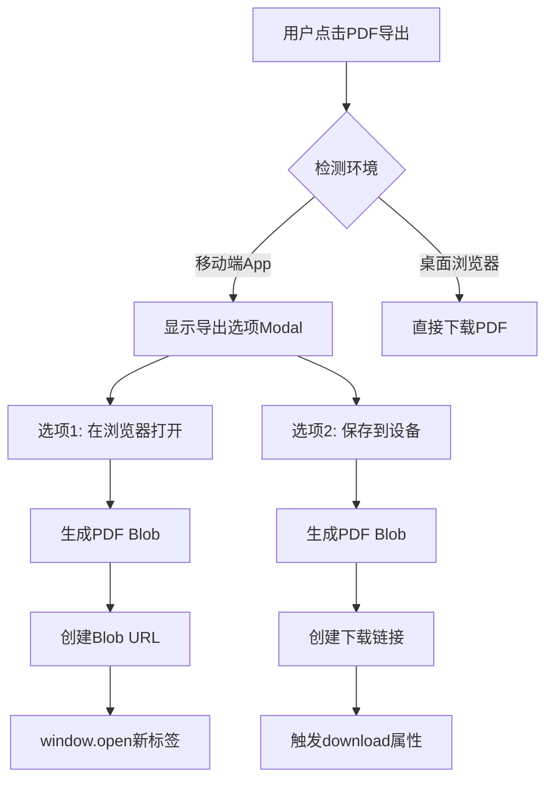

# 移动端PDF导出简化方案

## 📋 方案调整说明

### 原方案 vs 简化方案

| 特性 | 原方案 | 简化方案 |
|------|--------|----------|
| PDF存储 | 存储PDF文件到Supabase Storage | ❌ 不存储PDF |
| 数据存储 | 新增WorkoutPDF模型 | ✅ 使用现有Workout模型 |
| 后端API | 3个新API端点 | ❌ 无需新API |
| 导出方式 | 4种（浏览器、设备、分享、云端） | 2种（浏览器、设备） |
| 实施时间 | 8-11小时 | 2-3小时 |
| 复杂度 | 高（前后端） | 低（仅前端） |

### 核心优势
- ✅ **无需后端改动** - 利用现有Workout API
- ✅ **节省存储空间** - 不存储PDF文件
- ✅ **实时生成** - 每次根据最新数据生成PDF
- ✅ **快速实施** - 仅需前端改动，2-3小时完成
- ✅ **易于维护** - 代码量少，逻辑简单

---

## 🎯 简化方案设计

### 架构图



### 用户流程

#### 移动端流程
```
1. 用户完成训练
2. 点击"导出PDF"按钮
3. 系统检测到移动端环境
4. 显示导出选项Modal（2个选项）
5. 用户选择导出方式
6. 生成PDF并执行对应操作
7. 显示成功提示
```

#### 桌面端流程
```
1. 用户完成训练
2. 点击"导出PDF"按钮
3. 系统检测到桌面环境
4. 直接下载PDF到本地
5. 显示成功提示
```

---

## 🔧 实施细节

### 1. PDFExportOptionsModal组件

**文件位置**: `frontend/src/features/export/components/PDFExportOptionsModal.tsx`

**Props接口**:
```typescript
interface PDFExportOptionsModalProps {
  isOpen: boolean;
  onClose: () => void;
  pdfBlob: Blob;
  fileName: string;
}
```

**UI设计**:
```
┌─────────────────────────────────────┐
│  导出PDF                      [X]   │
├─────────────────────────────────────┤
│                                     │
│  ┌───────────────────────────────┐ │
│  │ 🌐 在浏览器中打开             │ │
│  │ 在新标签页中查看PDF           │ │
│  └───────────────────────────────┘ │
│                                     │
│  ┌───────────────────────────────┐ │
│  │ 💾 保存到设备                 │ │
│  │ 下载PDF到本地存储             │ │
│  └───────────────────────────────┘ │
│                                     │
└─────────────────────────────────────┘
```

**组件代码结构**:
```typescript
export const PDFExportOptionsModal: React.FC<PDFExportOptionsModalProps> = ({
  isOpen,
  onClose,
  pdfBlob,
  fileName
}) => {
  const [isProcessing, setIsProcessing] = useState(false);
  const [error, setError] = useState<string | null>(null);

  const handleOpenInBrowser = async () => {
    setIsProcessing(true);
    setError(null);
    try {
      openPDFInBrowser(pdfBlob);
      onClose();
    } catch (err) {
      setError(err instanceof Error ? err.message : '打开失败');
    } finally {
      setIsProcessing(false);
    }
  };

  const handleSaveToDevice = async () => {
    setIsProcessing(true);
    setError(null);
    try {
      savePDFToDevice(pdfBlob, fileName);
      onClose();
    } catch (err) {
      setError(err instanceof Error ? err.message : '保存失败');
    } finally {
      setIsProcessing(false);
    }
  };

  if (!isOpen) return null;

  return (
    <div className="fixed inset-0 z-50 flex items-center justify-center p-4">
      {/* Backdrop */}
      <div className="absolute inset-0 bg-black/85 backdrop-blur-sm" onClick={onClose} />
      
      {/* Modal */}
      <div className="relative bg-slate-900 rounded-2xl border border-slate-600/40 p-6 max-w-md w-full">
        {/* Header */}
        <div className="flex items-center justify-between mb-6">
          <h2 className="text-xl font-bold text-slate-100">导出PDF</h2>
          <button onClick={onClose} className="text-slate-400 hover:text-slate-200">
            <X size={24} />
          </button>
        </div>

        {/* Error Message */}
        {error && (
          <div className="mb-4 p-3 bg-red-500/10 border border-red-500/30 rounded-lg text-red-400 text-sm">
            {error}
          </div>
        )}

        {/* Options */}
        <div className="space-y-3">
          {/* Option 1: Open in Browser */}
          <button
            onClick={handleOpenInBrowser}
            disabled={isProcessing}
            className="w-full p-4 bg-slate-800/50 hover:bg-slate-800 border border-slate-600/30 hover:border-slate-500 rounded-xl transition-all text-left disabled:opacity-50 disabled:cursor-not-allowed"
          >
            <div className="flex items-center gap-3">
              <Globe size={24} className="text-blue-400" />
              <div>
                <div className="text-slate-100 font-medium">在浏览器中打开</div>
                <div className="text-slate-400 text-sm">在新标签页中查看PDF</div>
              </div>
            </div>
          </button>

          {/* Option 2: Save to Device */}
          <button
            onClick={handleSaveToDevice}
            disabled={isProcessing}
            className="w-full p-4 bg-slate-800/50 hover:bg-slate-800 border border-slate-600/30 hover:border-slate-500 rounded-xl transition-all text-left disabled:opacity-50 disabled:cursor-not-allowed"
          >
            <div className="flex items-center gap-3">
              <Download size={24} className="text-green-400" />
              <div>
                <div className="text-slate-100 font-medium">保存到设备</div>
                <div className="text-slate-400 text-sm">下载PDF到本地存储</div>
              </div>
            </div>
          </button>
        </div>

        {/* Processing Indicator */}
        {isProcessing && (
          <div className="mt-4 flex items-center justify-center gap-2 text-slate-400 text-sm">
            <div className="w-4 h-4 border-2 border-slate-400 border-t-transparent rounded-full animate-spin" />
            <span>处理中...</span>
          </div>
        )}
      </div>
    </div>
  );
};
```

---

### 2. 更新PDFExportService

**文件位置**: `frontend/src/features/export/services/PDFExportService.ts`

**新增函数**:

```typescript
/**
 * 检测是否在移动端App环境
 */
export const isMobileApp = (): boolean => {
  const ua = navigator.userAgent;
  const isWebView = /ZenFit|WebView|wv/i.test(ua);
  const isStandalone = window.matchMedia('(display-mode: standalone)').matches;
  const isIOSStandalone = (window.navigator as any).standalone === true;
  
  return isWebView || isStandalone || isIOSStandalone;
};

/**
 * 在浏览器中打开PDF
 * @param blob PDF Blob对象
 * @throws 如果无法打开新窗口
 */
export const openPDFInBrowser = (blob: Blob): void => {
  const url = URL.createObjectURL(blob);
  const newWindow = window.open(url, '_blank');
  
  if (!newWindow) {
    URL.revokeObjectURL(url);
    throw new Error('无法打开新窗口，请检查浏览器弹窗设置');
  }
  
  // 延迟释放URL，确保PDF已加载
  setTimeout(() => {
    URL.revokeObjectURL(url);
  }, 3000);
};

/**
 * 保存PDF到设备
 * @param blob PDF Blob对象
 * @param fileName 文件名
 */
export const savePDFToDevice = (blob: Blob, fileName: string): void => {
  const url = URL.createObjectURL(blob);
  const link = document.createElement('a');
  link.href = url;
  link.download = fileName;
  link.style.display = 'none';
  
  document.body.appendChild(link);
  link.click();
  document.body.removeChild(link);
  
  // 快速释放URL
  setTimeout(() => {
    URL.revokeObjectURL(url);
  }, 100);
};
```

**修改generateWorkoutPDF函数**:

将返回类型从`Promise<void>`改为`Promise<{ blob: Blob; fileName: string }>`

```typescript
export const generateWorkoutPDF = async (
  session: WorkoutSession,
  userProfile: UserProfile
): Promise<{ blob: Blob; fileName: string }> => {
  // ... 现有PDF生成逻辑保持不变 ...
  
  // 在函数末尾，不再直接下载，而是返回blob和文件名
  const blob = pdf.output('blob');
  const sessionDate = new Date(session.date);
  const fileName = `ZenFit_Workout_${sessionDate.toISOString().split('T')[0]}.pdf`;
  
  return { blob, fileName };
};
```

---

### 3. 更新WorkoutReportModal

**文件位置**: `frontend/src/features/report/components/WorkoutReportModal.tsx`

**添加状态**:
```typescript
const [showPDFOptions, setShowPDFOptions] = useState(false);
const [pdfData, setPDFData] = useState<{ blob: Blob; fileName: string } | null>(null);
```

**修改handlePDFExport函数**:
```typescript
const handlePDFExport = async () => {
  setIsExportingPDF(true);
  try {
    // 生成PDF
    const { blob, fileName } = await generateWorkoutPDF(enhancedSession, userProfile);
    
    // 检测环境
    if (isMobileApp()) {
      // 移动端：显示选项Modal
      setPDFData({ blob, fileName });
      setShowPDFOptions(true);
    } else {
      // 桌面端：直接下载
      savePDFToDevice(blob, fileName);
    }
  } catch (error) {
    console.error('PDF export error:', error);
    alert(error instanceof Error ? error.message : 'Failed to export PDF');
  } finally {
    setIsExportingPDF(false);
  }
};
```

**添加Modal组件**:
```typescript
{showPDFOptions && pdfData && (
  <PDFExportOptionsModal
    isOpen={showPDFOptions}
    onClose={() => {
      setShowPDFOptions(false);
      setPDFData(null);
    }}
    pdfBlob={pdfData.blob}
    fileName={pdfData.fileName}
  />
)}
```

---

## 📱 兼容性说明

### 支持的平台

| 平台 | 浏览器打开 | 保存到设备 |
|------|-----------|-----------|
| iOS Safari | ✅ | ✅ |
| iOS WebView | ✅ | ✅ |
| Android Chrome | ✅ | ✅ |
| Android WebView | ✅ | ✅ |
| Desktop Chrome | ✅ | ✅ |
| Desktop Safari | ✅ | ✅ |
| Desktop Firefox | ✅ | ✅ |
| Desktop Edge | ✅ | ✅ |

### 降级策略

1. **弹窗被阻止**
   - 显示错误提示："无法打开新窗口，请检查浏览器弹窗设置"
   - 建议用户使用"保存到设备"选项

2. **下载失败**
   - 显示错误提示："下载失败，请重试"
   - 提供重试按钮

---

## 🚀 实施步骤

### Step 1: 创建PDFExportOptionsModal组件 (30分钟)
- [ ] 创建组件文件
- [ ] 实现UI布局
- [ ] 添加交互逻辑
- [ ] 添加错误处理

### Step 2: 更新PDFExportService (30分钟)
- [ ] 添加`isMobileApp()`函数
- [ ] 添加`openPDFInBrowser()`函数
- [ ] 添加`savePDFToDevice()`函数
- [ ] 修改`generateWorkoutPDF()`返回类型

### Step 3: 更新WorkoutReportModal (30分钟)
- [ ] 添加状态管理
- [ ] 修改`handlePDFExport()`函数
- [ ] 集成PDFExportOptionsModal
- [ ] 测试环境检测逻辑

### Step 4: 测试和优化 (60分钟)
- [ ] 移动端真机测试（iOS）
- [ ] 移动端真机测试（Android）
- [ ] 桌面浏览器测试
- [ ] 错误场景测试
- [ ] UI/UX优化

**总计时间**: 约2.5小时

---

## 🎯 测试清单

### 功能测试
- [ ] 移动端显示选项Modal
- [ ] 桌面端直接下载
- [ ] "在浏览器打开"功能正常
- [ ] "保存到设备"功能正常
- [ ] PDF内容正确生成
- [ ] 文件名格式正确

### 错误处理测试
- [ ] 弹窗被阻止时显示错误
- [ ] 下载失败时显示错误
- [ ] PDF生成失败时显示错误
- [ ] 用户取消操作时正常关闭

### UI/UX测试
- [ ] Modal动画流畅
- [ ] 按钮hover效果正常
- [ ] Loading状态显示正确
- [ ] 错误提示清晰明确
- [ ] 响应式布局正常

### 兼容性测试
- [ ] iOS Safari
- [ ] Android Chrome
- [ ] Desktop Chrome
- [ ] Desktop Safari
- [ ] Desktop Firefox

---

## 📊 成功指标

- ✅ PDF生成成功率 > 99%
- ✅ 移动端用户能够成功导出PDF
- ✅ 桌面端用户体验不受影响
- ✅ 错误提示清晰友好
- ✅ 实施时间 < 3小时

---

## 🔄 未来扩展

### Phase 2: 添加分享功能 (1小时)
- 实现Web Share API集成
- 添加"分享"选项到Modal
- 处理不支持分享的浏览器

### Phase 3: 添加云端同步 (如需要)
- 实现训练数据自动同步
- 添加历史记录查看
- 实现跨设备访问

---

## 📝 总结

这个简化方案：
- ✅ **无需后端改动** - 利用现有API
- ✅ **快速实施** - 2.5小时完成
- ✅ **易于维护** - 代码简洁
- ✅ **用户体验好** - 流程清晰
- ✅ **成本低** - 无存储成本

完美解决了移动端PDF导出问题，同时保持了代码的简洁性和可维护性。