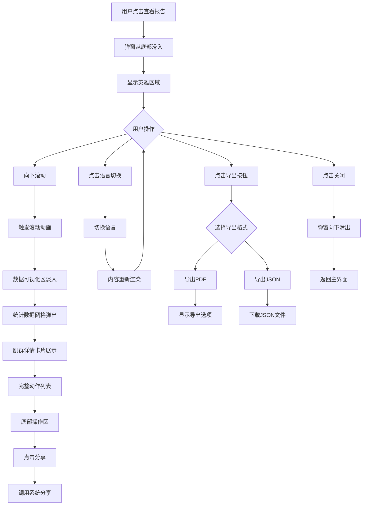
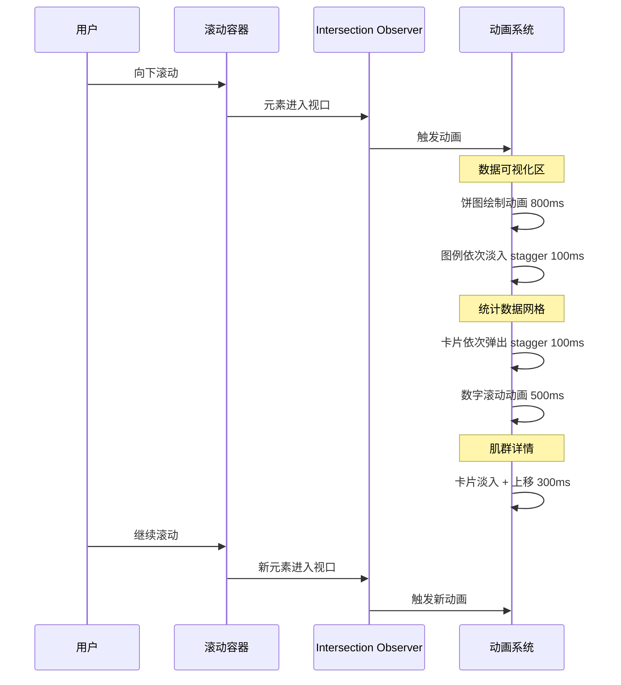
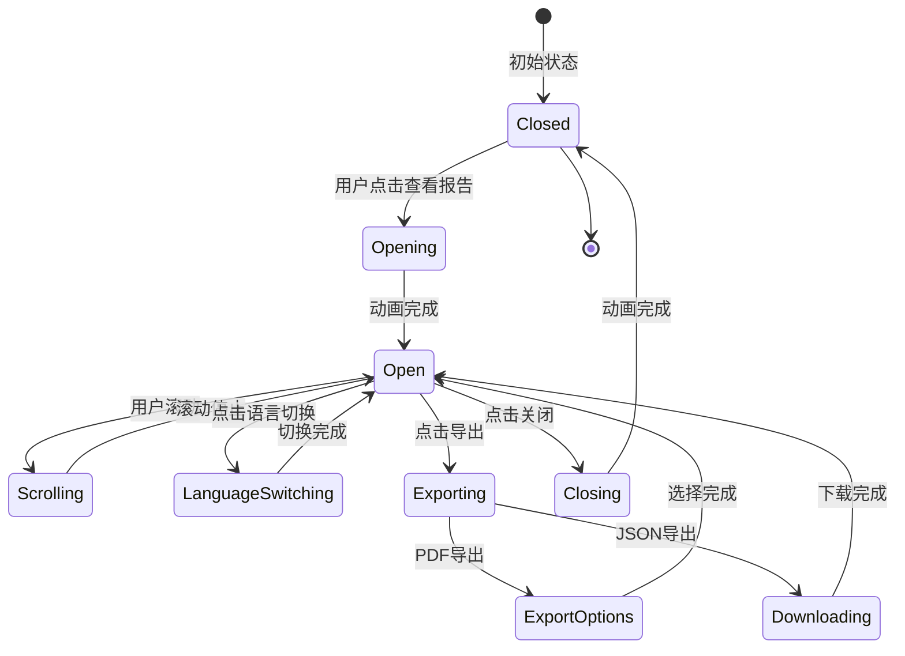
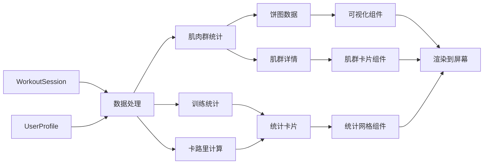
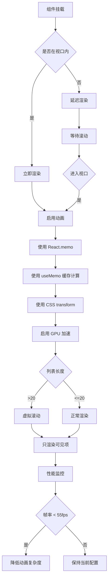
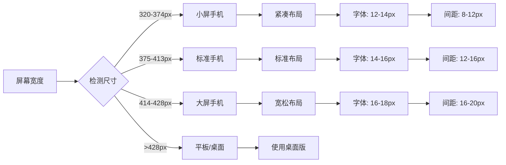
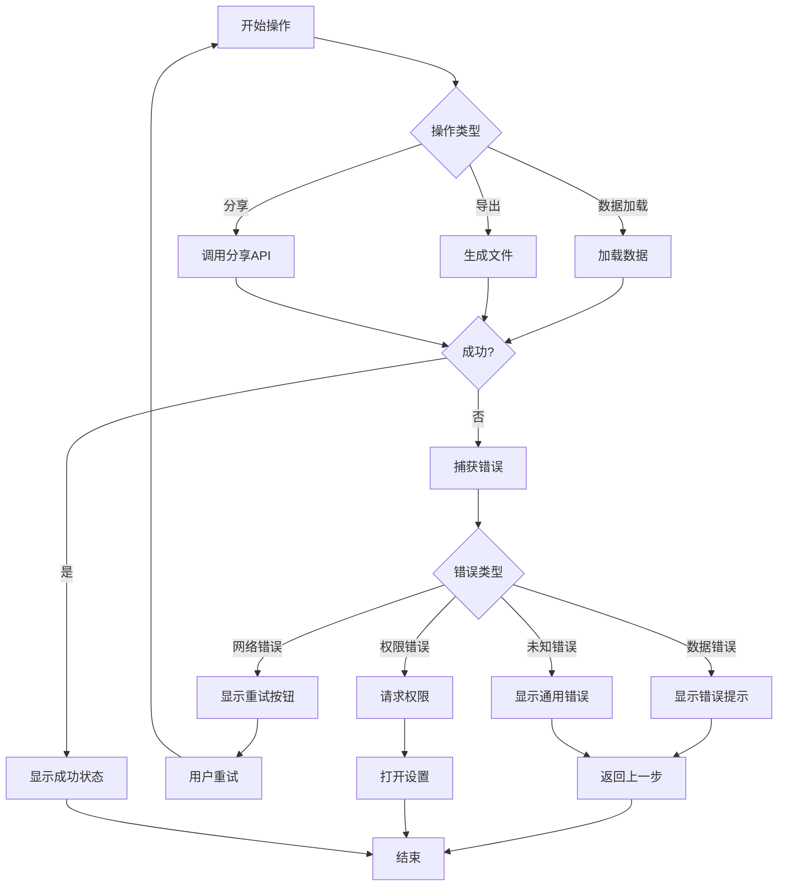
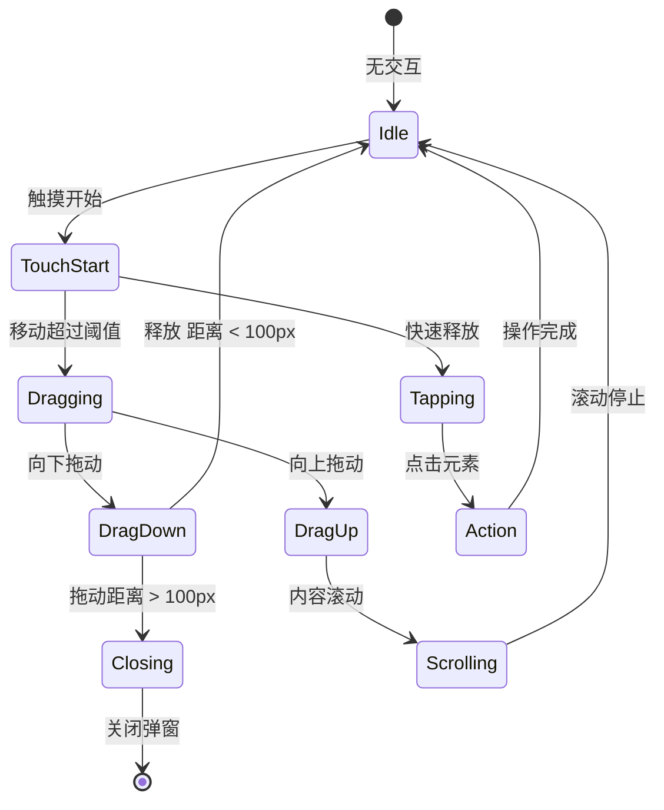

# 移动端全息报告交互流程图

## 用户交互流程

```mermaid
graph TD
    A[用户点击查看报告] --> B[弹窗从底部滑入]
    B --> C[显示英雄区域]
    C --> D{用户操作}
    
    D --> E[向下滚动]
    D --> F[点击语言切换]
    D --> G[点击导出按钮]
    D --> H[点击关闭]
    
    E --> I[触发滚动动画]
    I --> J[数据可视化区淡入]
    J --> K[统计数据网格弹出]
    K --> L[肌群详情卡片展示]
    L --> M[完整动作列表]
    M --> N[底部操作区]
    
    F --> O[切换语言]
    O --> P[内容重新渲染]
    P --> D
    
    G --> Q{选择导出格式}
    Q --> R[导出PDF]
    Q --> S[导出JSON]
    R --> T[显示导出选项]
    S --> U[下载JSON文件]
    
    H --> V[弹窗向下滑出]
    V --> W[返回主界面]
    
    N --> X[点击分享]
    X --> Y[调用系统分享]
```

## 滚动触发动画序列

```mermaid
sequenceDiagram
    participant U as 用户
    participant S as 滚动容器
    participant O as Intersection Observer
    participant A as 动画系统
    
    U->>S: 向下滚动
    S->>O: 元素进入视口
    O->>A: 触发动画
    
    Note over A: 数据可视化区
    A->>A: 饼图绘制动画 800ms
    A->>A: 图例依次淡入 stagger 100ms
    
    Note over A: 统计数据网格
    A->>A: 卡片依次弹出 stagger 100ms
    A->>A: 数字滚动动画 500ms
    
    Note over A: 肌群详情
    A->>A: 卡片淡入 + 上移 300ms
    
    U->>S: 继续滚动
    S->>O: 新元素进入视口
    O->>A: 触发新动画
```

## 组件状态管理

```mermaid
stateDiagram-v2
    [*] --> Closed: 初始状态
    Closed --> Opening: 用户点击查看报告
    Opening --> Open: 动画完成
    
    Open --> Scrolling: 用户滚动
    Scrolling --> Open: 滚动停止
    
    Open --> LanguageSwitching: 点击语言切换
    LanguageSwitching --> Open: 切换完成
    
    Open --> Exporting: 点击导出
    Exporting --> ExportOptions: PDF导出
    Exporting --> Downloading: JSON导出
    ExportOptions --> Open: 选择完成
    Downloading --> Open: 下载完成
    
    Open --> Closing: 点击关闭
    Closing --> Closed: 动画完成
    
    Closed --> [*]
```

## 数据流向

```mermaid
flowchart LR
    A[WorkoutSession] --> B[数据处理]
    C[UserProfile] --> B
    
    B --> D[肌肉群统计]
    B --> E[训练统计]
    B --> F[卡路里计算]
    
    D --> G[饼图数据]
    D --> H[肌群详情]
    
    E --> I[统计卡片]
    
    F --> I
    
    G --> J[可视化组件]
    H --> K[肌群卡片组件]
    I --> L[统计网格组件]
    
    J --> M[渲染到屏幕]
    K --> M
    L --> M
```

## 性能优化策略

```mermaid
graph TB
    A[组件挂载] --> B{是否在视口内}
    
    B -->|是| C[立即渲染]
    B -->|否| D[延迟渲染]
    
    C --> E[启用动画]
    D --> F[等待滚动]
    
    F --> G{进入视口}
    G -->|是| E
    
    E --> H[使用 React.memo]
    H --> I[使用 useMemo 缓存计算]
    I --> J[使用 CSS transform]
    J --> K[启用 GPU 加速]
    
    K --> L{列表长度}
    L -->|>20| M[虚拟滚动]
    L -->|<=20| N[正常渲染]
    
    M --> O[只渲染可见项]
    N --> O
    
    O --> P[性能监控]
    P --> Q{帧率 < 55fps}
    Q -->|是| R[降低动画复杂度]
    Q -->|否| S[保持当前配置]
```

## 响应式布局策略

```mermaid
graph LR
    A[屏幕宽度] --> B{检测尺寸}
    
    B -->|320-374px| C[小屏手机]
    B -->|375-413px| D[标准手机]
    B -->|414-428px| E[大屏手机]
    B -->|>428px| F[平板/桌面]
    
    C --> G[紧凑布局]
    D --> H[标准布局]
    E --> I[宽松布局]
    F --> J[使用桌面版]
    
    G --> K[字体: 12-14px]
    H --> L[字体: 14-16px]
    I --> M[字体: 16-18px]
    
    K --> N[间距: 8-12px]
    L --> O[间距: 12-16px]
    M --> P[间距: 16-20px]
```

## 错误处理流程

```mermaid
flowchart TD
    A[开始操作] --> B{操作类型}
    
    B -->|数据加载| C[加载数据]
    B -->|导出| D[生成文件]
    B -->|分享| E[调用分享API]
    
    C --> F{成功?}
    D --> F
    E --> F
    
    F -->|是| G[显示成功状态]
    F -->|否| H[捕获错误]
    
    H --> I{错误类型}
    
    I -->|网络错误| J[显示重试按钮]
    I -->|数据错误| K[显示错误提示]
    I -->|权限错误| L[请求权限]
    I -->|未知错误| M[显示通用错误]
    
    J --> N[用户重试]
    K --> O[返回上一步]
    L --> P[打开设置]
    M --> O
    
    N --> A
    O --> Q[结束]
    P --> Q
    G --> Q
```

## 动画时间轴

```mermaid
gantt
    title 入场动画时间轴
    dateFormat SSS
    axisFormat %L ms
    
    section 背景
    背景淡入           :a1, 000, 300ms
    
    section 顶部栏
    顶部栏滑入         :a2, 100, 400ms
    
    section 英雄区
    英雄区滑入         :a3, 200, 500ms
    扫描线动画         :a4, 400, 2000ms
    
    section 数据卡片
    卡片1弹出          :a5, 400, 300ms
    卡片2弹出          :a6, 500, 300ms
    数字滚动           :a7, 600, 500ms
    
    section 准备就绪
    等待用户滚动       :a8, 900, 100ms
```

## 手势交互

```mermaid
stateDiagram-v2
    [*] --> Idle: 无交互
    
    Idle --> TouchStart: 触摸开始
    TouchStart --> Dragging: 移动超过阈值
    TouchStart --> Tapping: 快速释放
    
    Dragging --> DragDown: 向下拖动
    Dragging --> DragUp: 向上拖动
    
    DragDown --> Closing: 拖动距离 > 100px
    DragDown --> Idle: 释放 距离 < 100px
    
    DragUp --> Scrolling: 内容滚动
    Scrolling --> Idle: 滚动停止
    
    Tapping --> Action: 点击元素
    Action --> Idle: 操作完成
    
    Closing --> [*]: 关闭弹窗
```
